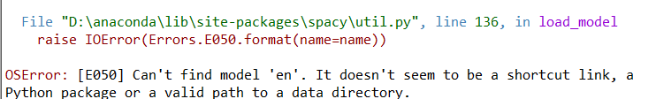
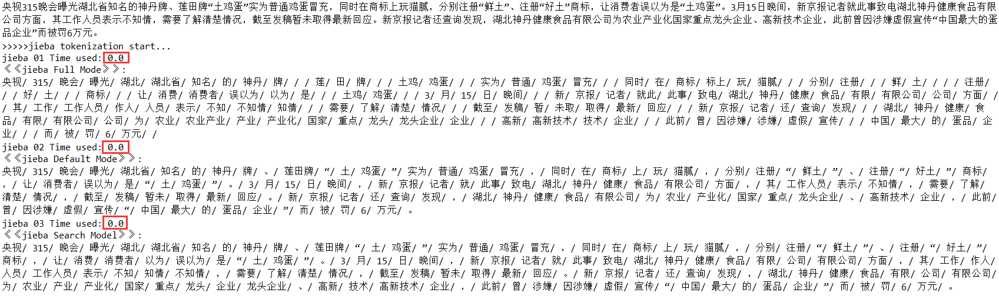
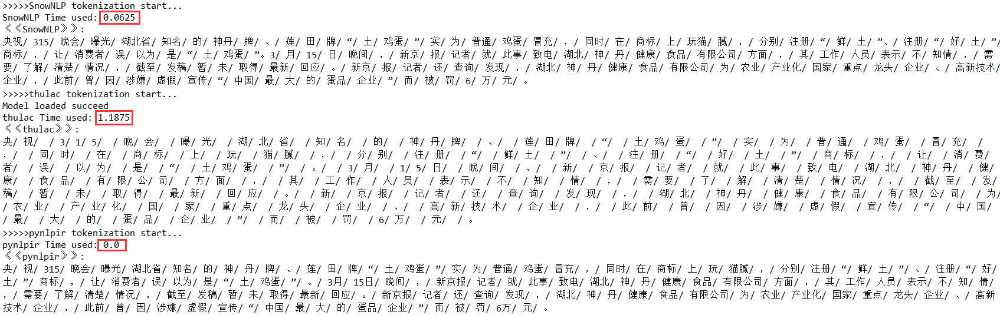
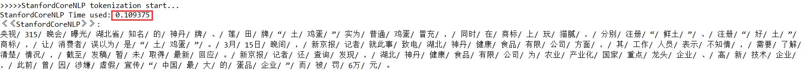
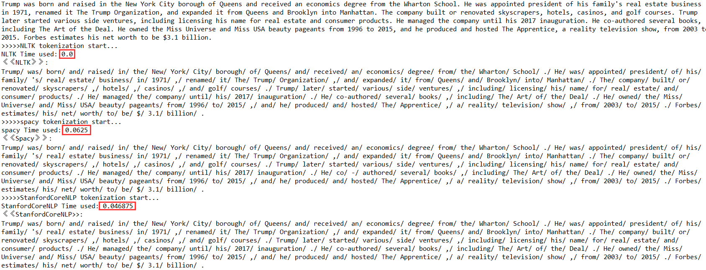
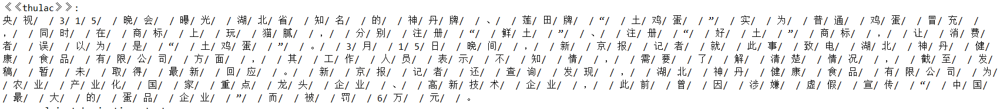

计算机科学与技术学院*自然语言处理*课程实验报告

| 实验目的： 要求：利用给定的中英文文本序列（见 Chinese.txt 和 English.txt），分别利用以下给定的中 英文分词工具进行分词并对不同分词工具产生的结果进行简要对比分析，将实验过程与结果 写成实验报告，实验课结束后提交。                                                                                                                                                                                                                                                              |
|---------------------------------------------------------------------------------------------------------------------------------------------------------------------------------------------------------------------------------------------------------------------------------------------------------------------------------------------------------------------------------------------------------------------------------------------------------------------------------|
| 实验软件和硬件环境：  **一、硬件环境： **                                                                                                                                                                                                                                                                                                                                                                                                                                       |
| 实验原理和方法： 根据实验指导的链接教程等，安装好各种用于中英文分词的工具包，并对实验文件的Chinese.txt和English.txt文本文件进行运行测试。最后对不同工具包的分词结果进行汇总，进行简单对比分析。                                                                                                                                                                                                                                                                                 |
| 实验步骤：（不要求罗列完整源代码）                                                                                                                                                                                                                                                                                                                                                                                                                                              |
| 结论分析与体会： 一、对于汉语分词结果，从速度上可以发现，五种方法粗略用时（因为各工具包模块功能不同，只能粗略比较）从小到大为： **jieba ≈ pynlpir \< SnowNLP \< StanfordCoreNLP \< thulac** 对于分词结果，个人看来，StanfordCoreNLP、pynlpir 以及SnowNLP表现得最好，但也各有瑕疵，例如对“实为”、“误以为”、“玩猫腻”等词的划分有少许不一致，总体表现较好，其次是jieba,其分词结果较一般，最后是thulac，它将很多词语分的太碎，会丢失很多语义信息，如下所示：个人感觉分词效果不好 。 |

>   CPU

>   Intel Core i5 7200U \@ 2.50GHz 41 °C

>   Kaby Lake-U/Y 14nm工艺

>   RAM

>   8.00GB 单个的-通道 未知 (15-15-15-35)

>   主板

>   HP 81D1 (U3E1)

>   图像

>   Generic PnP Monitor (1920x1080\@60Hz)

>   Intel HD Graphics 620 (HP)

>   存储器

>   476GB NVMe THNSN5512GPUK TO (未知)

>   40GB Microsoft 虚拟磁盘 (File-backed Virtual)

>   光盘驱动器

>   没有检测到光纤磁盘驱动

>   音频

Conexant ISST Audio

**二、软件环境：**

>   操作系统

>   Windows 10 家庭中文版 64-bit

平台编程环境

>   anaconda + python3.7

1.  在python环境中安装好各种工具包：

主要利用到pip命令，一般都能快速成功安装。其中有几个需注意的地方：

1.  第一是Stanfordcorenlp的安装过程中：

>   首先要配置好java环境，下载安装1.8版本以上的JDK;配置好Java的环境变量Path和java_home等，需要注意最好重启让系统环境变量生效；否则可能遇到如下报错：

>   而后需要下载外接文件包，注意python的版本下载对应的包，而后进行解压，对中文进行处理时需要再另外下载一个对应的Chinese的jar包，放入之前的解压文件夹中。

>   （2）第二是spacy安装的过程中，可能会遇到权限不够的提示，

方法1是：要用管理员模式启动命令行

>   方法2是：用 nlp = spacy.load('en_core_web_sm')代替原来的

>   nlp = spacy.load(’en’)

>   （3）第三是注意文字编码，有些工具包需要指定为Unicode的编码模式，不然可能会有一些问题。

1.  编写代码运行测试：

二、对于英语分词结果比较，速度上从小到大如下：

**NLTK \< StanfordCoreNLP \< spacy**

对于分词结果，感觉表现都ok,不分上下。
