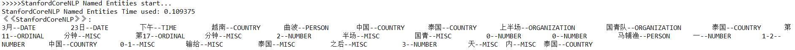
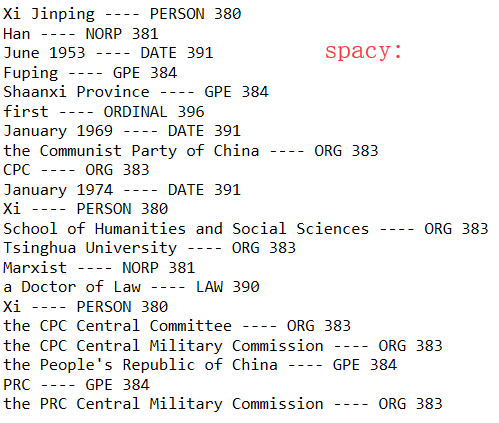

计算机科学与技术学院*自然语言处理*课程实验报告

 

| 实验目的： 要求：利用 Chinese.txt 和 English.txt 的中英文句子，在实验二的基础上，继 续利用以下给定的中英文工具进行词性标注和命名实体识别。并对不同工具产生 的结果进行简要对比分析，将实验过程与结果写成实验报告，实验课结束后提交。                                                                                                                                                                                                                                                                                                                                                                                    |
|------------------------------------------------------------------------------------------------------------------------------------------------------------------------------------------------------------------------------------------------------------------------------------------------------------------------------------------------------------------------------------------------------------------------------------------------------------------------------------------------------------------------------------------------------------------------------------------------------------------------|
| 实验软件和硬件环境：  **一、软件环境：**                                                                                                                                                                                                                                                                                                                                                                                                                                                                                                                                                                               |
| 实验原理和方法： 1、英文工具： Nltk： Spacy： Stanfordnlp： 2、中文工具：（部分工具命名实体识别没有直接调用的函数，可以根据词性 标注的结果自己实现）                                                                                                                                                                                                                                                                                                                                                                                                                                                                   |
| 实验步骤：（不要求罗列完整源代码）                                                                                                                                                                                                                                                                                                                                                                                                                                                                                                                                                                                     |
| 结论分析与体会： 结果简单对比分析：（1）中文文本进行词性标注，对于hanlp、jieba、SnowNLP、StanfordCoreNLP、thulac、pynlpir六种方法的结果观察可以发现，各方法的标注结果各有特点，主要是基于不同的分词结果，最终词性标注会受较大影响，总体上，就语义理解方面，StanfordCoreNLP的表现最好，较大程度保留了语义信息，并且标注得较详细，速度上也有一些优势；其次是 jieba、hanlp 和 SnowNLP 三种方法，对一些名词和动词短语也进行了较详细的标注，然后便是 thulac 和 pynlpir 两种方法，标注的类别较单一，对于复杂的nlp任务可能不能胜任。 （2）中文文本的命名实体识别，测试了StanfordCoreNLP方法，除去不能识别的实体外，结果如下： |

>   主机操作系统

>   Windows 10 家庭中文版 64-bit

平台编程环境

anaconda + python3.7

>   Jieba：

>   StanfordCoreNLP：

>   SnowNLP：

>   THULAC：

>   NLPIR：

>   HanLP（选做，需要 Microsoft Visual C++ 14.0）

1.  python工具包下载安装准备：

>   **（1）nltk**的命名实体功能模块安装：

>   **（2）pyhanlp**的安装：

>   <https://blog.csdn.net/huangjiajia123/article/details/84144583>

>   第一步：

>   下载
>   jpype：https://www.lfd.uci.edu/\~gohlke/pythonlibs/\#jpype下载对应版本已经编译好的whl文件。

>   将 .whl 文件保存到python 所在的script 文件夹下， 然后安装： pip install
>   【下载的文件名】

>   第二步： 安装 pyhanlp: pip install pyhanlp

>   第三步：
>   安装完成后并不能使用，需要下载一个jar包、data文件和properties文件，因为hanlp是java开发的虽然有python的API但是还是需要java环境，所以需要安装JDK，并配置Java
>   环境变量（即添加一个JAVA_HOME变量，变量值为java的bin目录的绝对路径）。

>   （1）打开 python IDE，输入 import pyhanlp， 会自动下载 HanLP jar
>   和properties 文件，默认放在 python -\>Lib-\>site packages 文件夹下的 pyhanlp
>   -\>static 文件夹下

>   （2）可以将 hanlp-1.7.0.jar 和hanlp.properties
>   移动到一个新的文件夹下，比如： D\\HanLp

>   （3）去https://github.com/hankcs/HanLP/releases 下载 hanlp 的data

1.  进行测试观察结果：

1、中文文本：

2、英语文本：

NLTK标注树状图：

（3）英文文本的词性标注结果，NLTK,Spacy,StanfordCoreNLP表现相差不多，对于命名实体识别，NLTK以树状图的形式，Spacy和stanfordcoreNlp都以标注给出，根据结果，个人感觉spacy的效果最好,对人名（eg:
Xi Jinping）等标注较好。如下：

